# 🚀 C++ i386/AMD64平台汇编指令对齐长度获取实现
**引用**：[fetch-x86-64-asm-il-size/main.cpp](https://github.com/liulilittle/fetch-x86-64-asm-il-size/blob/main/main.cpp)
## 🧠 一、处理器架构与指令集全景图

### 1.1 x86/x64架构深度演进
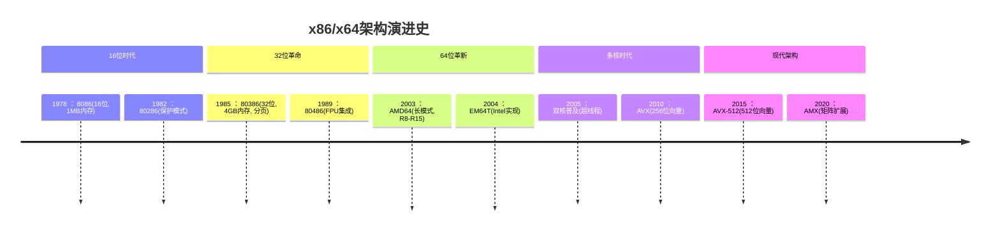

### 1.2 x86指令格式全解析
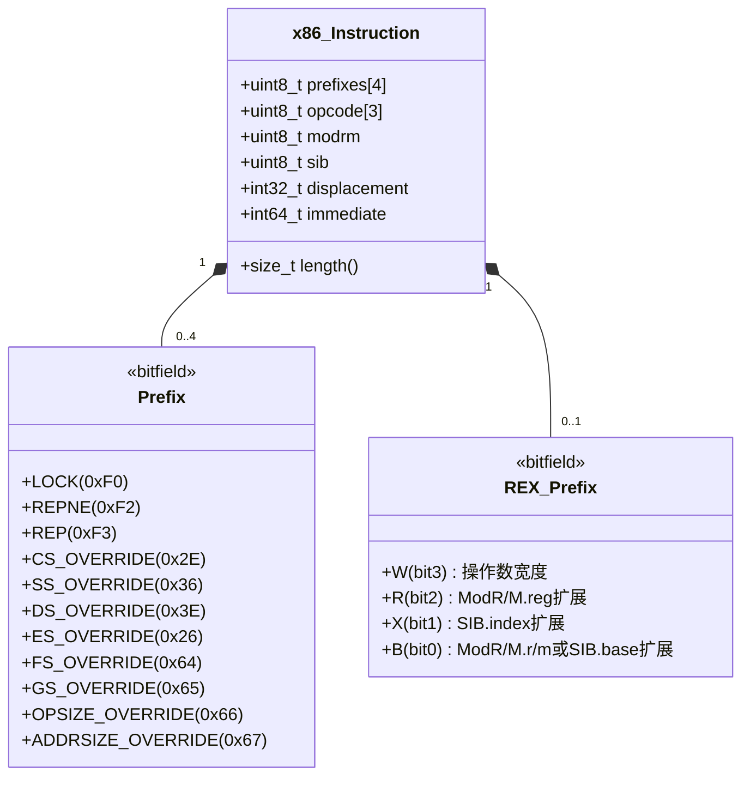

## 🧩 二、完整指令集支持详解

### 2.1 基础指令集 (8086~Pentium)

#### 数据处理指令
| 助记符 | 操作码 | 功能描述 | 示例 |
|--------|--------|----------|------|
| MOV | 0x88~0x8B | 数据传送 | `MOV AX, BX` |
| ADD | 0x00~0x03 | 加法 | `ADD CX, DX` |
| SUB | 0x28~0x2B | 减法 | `SUB AL, BL` |
| CMP | 0x38~0x3B | 比较 | `CMP SI, DI` |
| AND | 0x20~0x23 | 逻辑与 | `AND EAX, EBX` |
| OR | 0x08~0x0B | 逻辑或 | `OR CL, DL` |
| XOR | 0x30~0x33 | 异或 | `XOR AH, BH` |
| NOT | 0xF6/2 | 取反 | `NOT BYTE PTR [SI]` |
| NEG | 0xF6/3 | 取负 | `NEG CX` |

#### 控制流指令
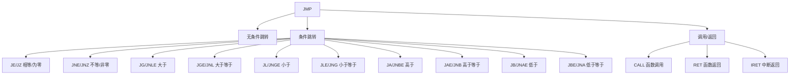

### 2.2 扩展指令集深度解析

#### MMX指令集 (多媒体扩展)
```c
// 典型MMX操作：像素Alpha混合
__m64 alpha_blend(__m64 src, __m64 dst, __m64 alpha) {
    __m64 one_minus_alpha = _mm_sub_pi8(_mm_set1_pi8(255), alpha);
    __m64 src_part = _mm_mullo_pi16(src, alpha);
    __m64 dst_part = _mm_mullo_pi16(dst, one_minus_alpha);
    return _mm_srli_pi16(_mm_add_pi16(src_part, dst_part), 8);
}
```

#### SSE系列指令集进化史
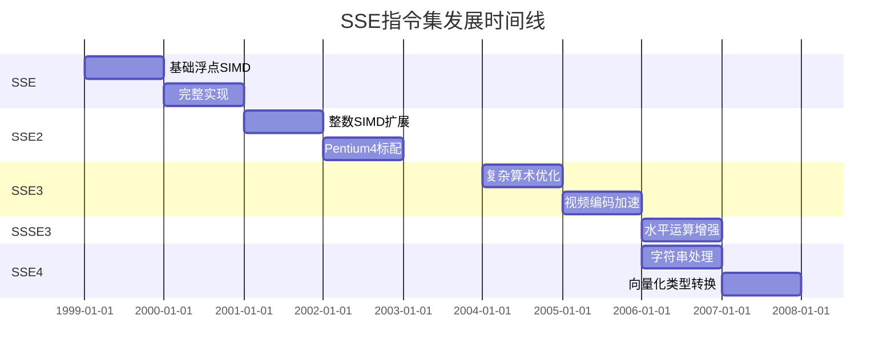


#### AVX指令集革命性突破
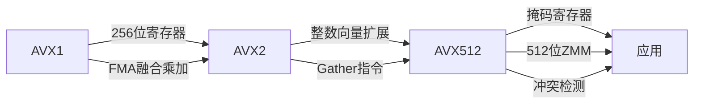

#### AES-NI指令集加速原理
```c
// AES-256-CTR加解密核心流程
void aesni_ctr_encrypt(const uint8_t *in, uint8_t *out, size_t len,
                       const AES_KEY *key, uint8_t ivec[16]) {
    __m128i ctr = _mm_loadu_si128((__m128i *)ivec);
    __m128i one = _mm_set_epi32(0,0,0,1);
    
    for (size_t i = 0; i < len; i += 16) {
        // 生成密钥流
        __m128i keystream = _mm_aesenc_si128(
            _mm_aesenc_si128(
                _mm_aesenc_si128(
                    _mm_aesenclast_si128(ctr, key->rd_key[0]),
                    key->rd_key[1]),
                key->rd_key[2]),
            key->rd_key[3]);
        
        // 计数器递增
        ctr = _mm_add_epi64(ctr, one);
        
        // XOR加密
        __m128i data = _mm_loadu_si128((__m128i *)(in + i));
        __m128i encrypted = _mm_xor_si128(data, keystream);
        _mm_storeu_si128((__m128i *)(out + i), encrypted);
    }
}
```

### 2.3 系统指令深度剖析

#### 特权指令工作机制
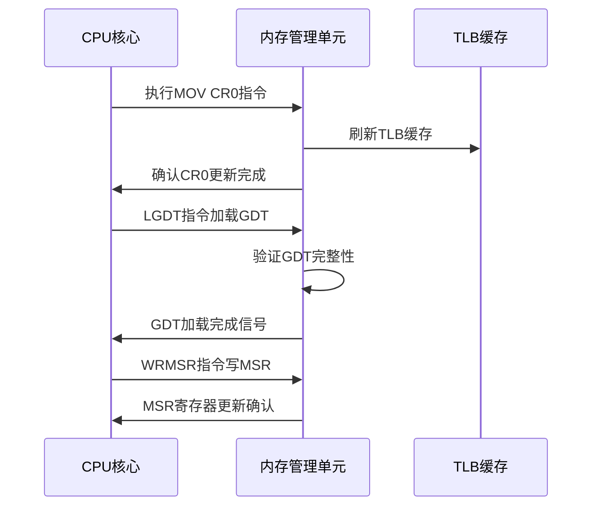

#### 调试指令应用场景
```c
// 使用RDTSCP进行精确性能测量
uint64_t measure_function(void (*func)(), int iterations) {
    uint64_t start, end;
    uint32_t aux;
    
    // 内存屏障
    __asm__ __volatile__("mfence");
    
    // 获取开始时间戳
    __asm__ __volatile__("rdtscp" : "=a" (start_low), "=d" (start_high), "=c" (aux));
    start = ((uint64_t)start_high << 32) | start_low;
    
    // 执行目标函数
    for (int i = 0; i < iterations; i++) {
        func();
    }
    
    // 内存屏障
    __asm__ __volatile__("mfence");
    
    // 获取结束时间戳
    __asm__ __volatile__("rdtscp" : "=a" (end_low), "=d" (end_high), "=c" (aux));
    end = ((uint64_t)end_high << 32) | end_low;
    
    return (end - start) / iterations;
}
```

## 🔍 三、指令解码器核心技术

### 3.1 解码引擎架构设计
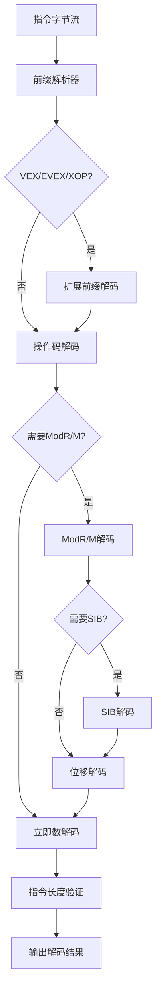

### 3.2 操作码解码算法
```c
size_t decode_opcode(const uint8_t* code, size_t offset, bool& has_vex, 
                    bool& is_evex, bool& is_xop, VEX_Prefix& vex) {
    if (has_vex) {
        // VEX/EVEX/XOP指令只有1字节操作码
        return 1;
    }
    
    uint8_t b1 = code[offset++];
    
    // 处理FPU指令 (0xD8-0xDF)
    if (b1 >= 0xD8 && b1 <= 0xDF) {
        return 1;
    }
    
    // 多字节操作码
    if (b1 == 0x0F) {
        uint8_t b2 = code[offset++];
        
        // 3DNow!指令 (0F 0F)
        if (b2 == 0x0F) {
            return 2;
        }
        
        // 三字节操作码 (0F 38/3A)
        if (b2 == 0x38 || b2 == 0x3A) {
            return 3;
        }
        
        return 2;
    }
    
    return 1;
}
```

### 3.3 ModR/M与SIB解码矩阵

#### ModR/M字段解码表
| Mod | Reg/Opcode | R/M | 32位模式 | 64位模式 |
|-----|------------|-----|----------|----------|
| 00  | 000        | 000 | [EAX]    | [RAX]    |
| 00  | 001        | 001 | [ECX]    | [RCX]    |
| ... | ...        | ... | ...      | ...      |
| 00  | 111        | 100 | [SIB]    | [SIB]    |
| 00  | 000        | 101 | [disp32] | [RIP+disp32] |
| 01  | 001        | 010 | [EDX+disp8] | [RDX+disp8] |
| 10  | 010        | 011 | [EBX+disp32] | [RBX+disp32] |
| 11  | 011        | 100 | ESP      | RSP      |

#### SIB解码算法
```c
size_t decode_sib(uint8_t modrm, const uint8_t* code, size_t size, size_t& offset) {
    uint8_t mod = modrm >> 6;
    uint8_t rm = modrm & 0x07;
    
    // 需要SIB的条件
    if (mod != 0b11 && rm == 0b100) {
        if (offset >= size) throw decoding_error("Missing SIB byte");
        
        uint8_t sib = code[offset++];
        uint8_t scale = (sib >> 6) & 0x03;
        uint8_t index = (sib >> 3) & 0x07;
        uint8_t base = sib & 0x07;
        
        // 特殊地址模式处理
        if (mod == 0b00 && base == 0b101) {
            // 32位: disp32, 64位: [RBP] 无位移
            return 1;
        }
        
        return 1;
    }
    
    return 0;
}
```

### 3.4 位移与立即数处理
```c
size_t decode_displacement(uint8_t modrm, size_t& offset) {
    uint8_t mod = modrm >> 6;
    uint8_t rm = modrm & 0x07;
    
    switch (mod) {
        case 0b00:
            if (rm == 0b101) {
                // RIP相对或直接地址
                return 4;
            }
            return 0;
        case 0b01:
            return 1;
        case 0b10:
            return 4;
        default:
            return 0;
    }
}

size_t decode_immediate(OpcodeInfo opcode, PrefixState prefix, 
                        bool has_modrm, uint8_t modrm) {
    // 根据操作码类型确定立即数大小
    switch (opcode.type) {
        case OP_IMM8:
            return 1;
        case OP_IMM16:
            return 2;
        case OP_IMM32:
            return 4;
        case OP_IMM64:
            return 8;
        case OP_MOFFS:
            return prefix.addr_size ? 4 : 6; // 32位4字节, 16位6字节
        default:
            // 特殊指令处理
            if (opcode.value == 0xE8 || opcode.value == 0xE9) {
                // CALL/JMP rel32
                return 4;
            }
            if (opcode.value >= 0xB0 && opcode.value <= 0xB7) {
                // MOV r8, imm8
                return 1;
            }
            if (opcode.value >= 0xB8 && opcode.value <= 0xBF) {
                // MOV r32/64, imm32/imm64
                return prefix.rex_w ? 8 : 4;
            }
            return 0;
    }
}
```

## 🛠️ 四、高级解码技术

### 4.1 向量化解码优化
```c
// 使用AVX2加速前缀扫描
size_t avx2_scan_prefixes(const uint8_t* code, size_t size) {
    const __m256i prefix_mask = _mm256_setr_epi8(
        0xF0, 0xF2, 0xF3, 0x2E, 0x36, 0x3E, 0x26, 0x64,
        0x65, 0x66, 0x67, 0x40, 0x41, 0x42, 0x43, 0x44,
        0x45, 0x46, 0x47, 0x48, 0x49, 0x4A, 0x4B, 0x4C,
        0x4D, 0x4E, 0x4F, 0, 0, 0, 0, 0);
    
    size_t count = 0;
    while (count < 4 && count < size) {
        // 加载16字节数据
        __m256i data = _mm256_loadu_si256((__m256i*)(code + count));
        
        // 比较是否为前缀
        __m256i cmp = _mm256_cmpeq_epi8(data, prefix_mask);
        int mask = _mm256_movemask_epi8(cmp);
        
        // 没有更多前缀
        if (mask == 0) break;
        
        // 计算连续前缀数量
        int prefix_count = __builtin_ctz(mask);
        count += prefix_count;
    }
    
    return count;
}
```

### 4.2 多核并行解码
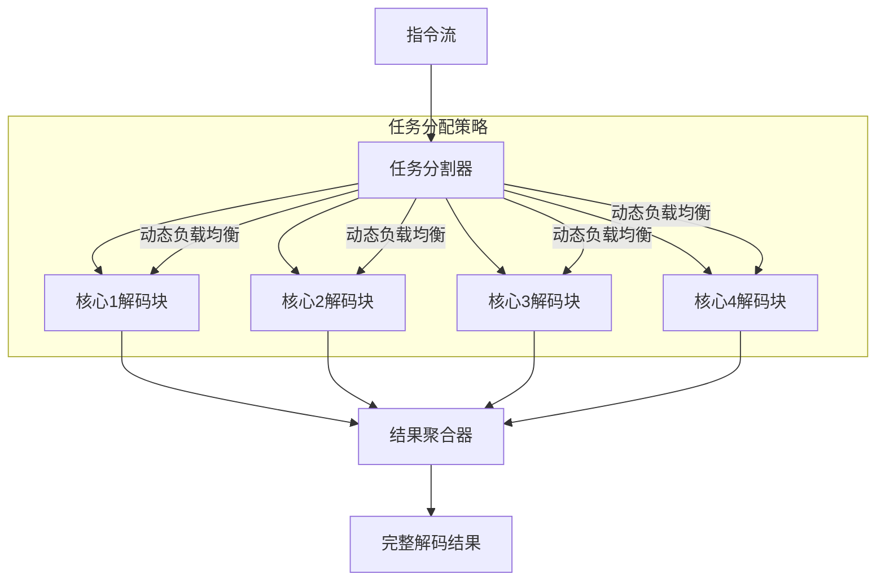

### 4.3 基于机器学习的指令预测
```python
import tensorflow as tf
from tensorflow.keras.layers import LSTM, Dense, Embedding

# 指令序列预测模型
def build_decoder_model(vocab_size, embedding_dim, rnn_units):
    model = tf.keras.Sequential([
        Embedding(vocab_size, embedding_dim),
        LSTM(rnn_units, return_sequences=True),
        LSTM(rnn_units, return_sequences=True),
        Dense(vocab_size)
    ])
    
    model.compile(loss=tf.keras.losses.SparseCategoricalCrossentropy(from_logits=True),
                  optimizer='adam')
    return model

# 训练指令预测模型
def train_instruction_predictor(instruction_dataset):
    # 指令映射到数字
    tokenizer = tf.keras.preprocessing.text.Tokenizer()
    tokenizer.fit_on_texts(instruction_dataset)
    
    # 创建训练序列
    sequences = tokenizer.texts_to_sequences(instruction_dataset)
    padded_sequences = tf.keras.preprocessing.sequence.pad_sequences(sequences)
    
    # 准备训练数据
    X = padded_sequences[:, :-1]
    y = padded_sequences[:, 1:]
    
    # 构建模型
    model = build_decoder_model(len(tokenizer.word_index)+1, 256, 1024)
    
    # 训练
    model.fit(X, y, epochs=50, batch_size=64)
    
    return model, tokenizer
```

## 🔬 五、解码器测试与验证

### 5.1 测试框架设计
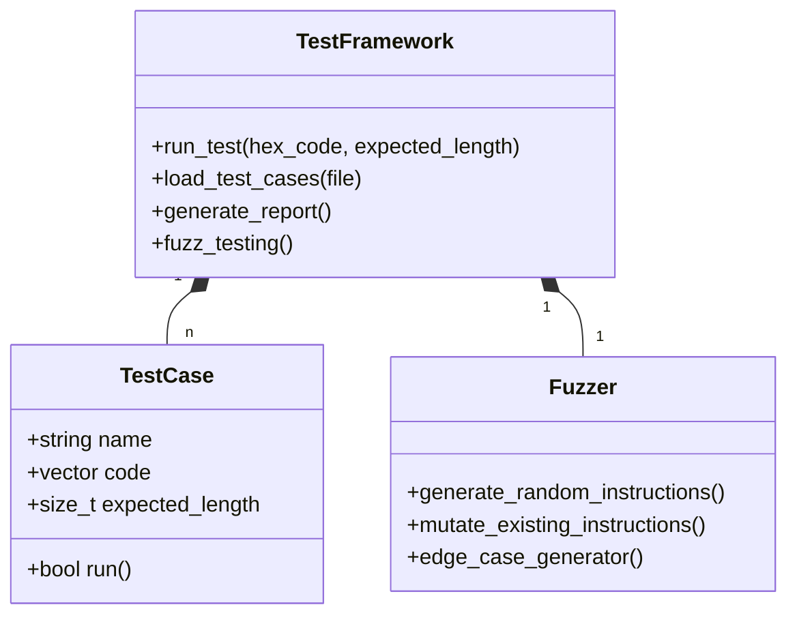

### 5.2 全面测试用例集
```cpp
// 指令长度测试用例
TEST_CASE("AVX-512 Instruction Lengths") {
    // EVEX前缀指令
    test({0x62, 0xF1, 0x7D, 0x48, 0x6F, 0x00}, 6); // VMOVDQA32 zmm0, [rax]
    test({0x62, 0xF2, 0x7D, 0x48, 0x65, 0xC0}, 6); // VPERMB zmm0, zmm1, zmm0
    
    // 带掩码的指令
    test({0x62, 0xF1, 0xFD, 0xC8, 0x6F, 0x00}, 6); // VMOVDQA64 zmm0 {k1}{z}, [rax]
    
    // 广播指令
    test({0x62, 0xF1, 0x7D, 0x58, 0x10, 0x00}, 6); // VMOVUPS zmm0 {k1}{z}, [rax]{1to16}
}

TEST_CASE("Complex Addressing Modes") {
    // SIB + 位移
    test({0x48, 0x8B, 0x84, 0xD5, 0x00, 0x11, 0x00, 0x00}, 8); // MOV RAX, [RBP+RDX*8+0x1100]
    
    // RIP相对寻址
    test({0x48, 0x8B, 0x05, 0x78, 0x56, 0x34, 0x12}, 7); // MOV RAX, [RIP+0x12345678]
    
    // AVX2聚集加载
    test({0xC4, 0xE2, 0x7D, 0x90, 0x04, 0x95, 0x00, 0x10, 0x00, 0x00}, 10); // VPGATHERDD ymm0, [ebp+edx*4+0x1000], ymm1
}

TEST_CASE("Boundary Cases") {
    // 缓冲区不足
    test({0x0F, 0x38}, false); // 不完整的3字节操作码
    
    // 无效前缀序列
    test({0xF0, 0xF0, 0xF0, 0xF0, 0x90}, 5); // 多个LOCK前缀
    
    // 长模式特殊行为
    test({0x67, 0x48, 0x8B, 0x00}, 4); // 地址大小覆盖
}
```

## 🚀 六、性能优化深度策略

### 6.1 解码流水线优化
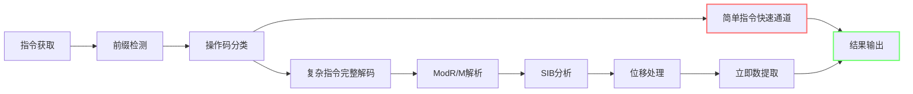

### 6.2 分支预测优化技术
```c
// 使用likely/unlikely优化分支预测
#define LIKELY(x)       __builtin_expect(!!(x), 1)
#define UNLIKELY(x)     __builtin_expect(!!(x), 0)

size_t decode_instruction(const uint8_t* code, size_t size) {
    // 高频指令快速路径
    if (LIKELY(size >= 1)) {
        switch (code[0]) {
            case 0x90: // NOP
                return 1;
            case 0xC3: // RET
                return 1;
            case 0xCC: // INT3
                return 1;
        }
    }
    
    // VEX前缀检测
    if (UNLIKELY(size >= 2 && (code[0] == 0xC4 || code[0] == 0xC5))) {
        return decode_vex_instruction(code, size);
    }
    
    // EVEX前缀检测
    if (UNLIKELY(size >= 4 && code[0] == 0x62)) {
        return decode_evex_instruction(code, size);
    }
    
    // 标准指令解码流程
    return decode_standard_instruction(code, size);
}
```

### 6.3 多级缓存设计
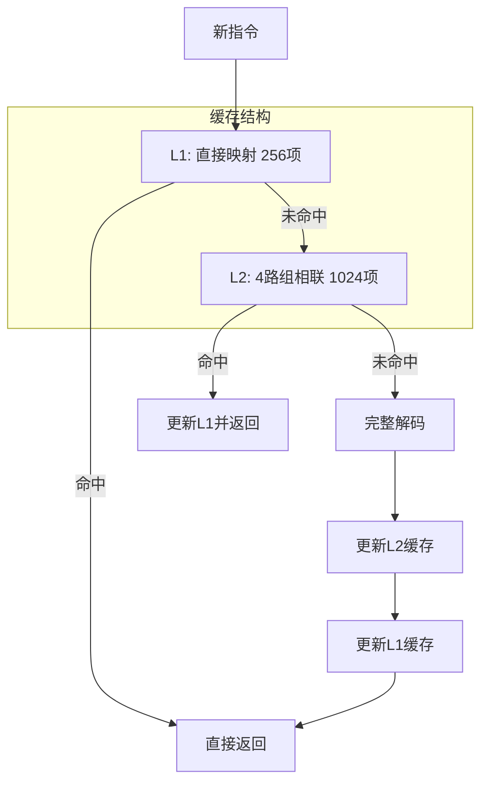

## 🌐 七、跨平台实现与优化

### 7.1 字节序处理策略
```c
// 统一字节序处理函数
uint64_t read_immediate(const uint8_t* data, size_t size, bool is_little_endian) {
    if (size == 0) return 0;
    
    uint64_t value = 0;
    if (is_little_endian) {
        for (size_t i = 0; i < size; i++) {
            value |= ((uint64_t)data[i]) << (i * 8);
        }
    } else {
        for (size_t i = 0; i < size; i++) {
            value = (value << 8) | data[i];
        }
    }
    return value;
}

// 系统字节序检测
bool system_is_little_endian() {
    const uint32_t test = 0x12345678;
    return *(const uint8_t*)&test == 0x78;
}
```

### 7.2 多架构支持矩阵

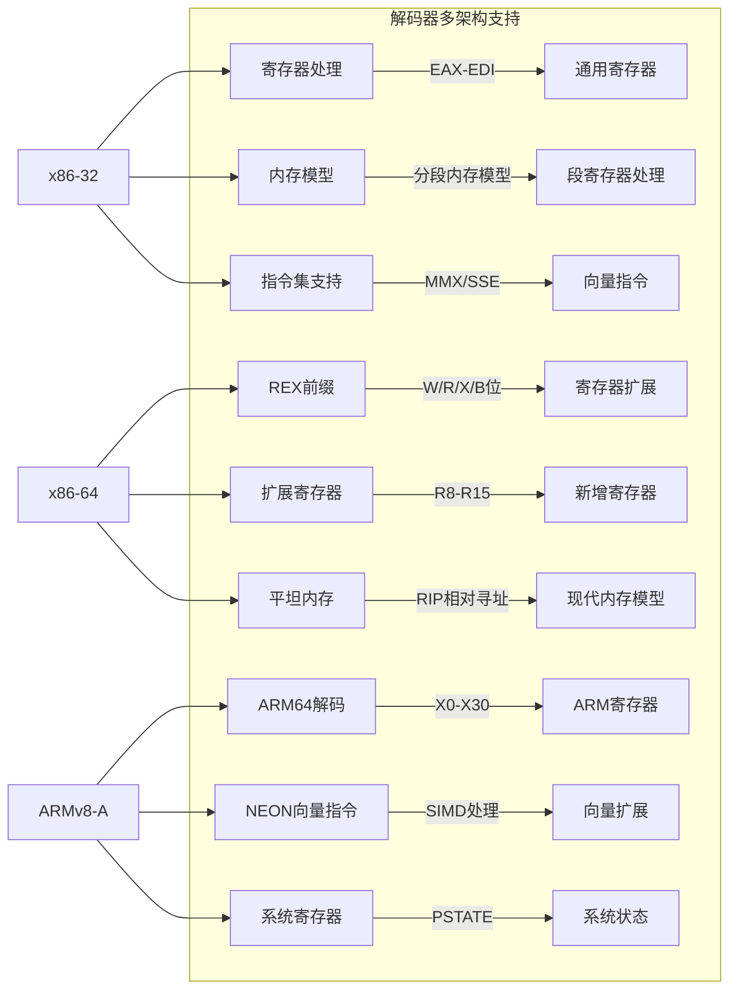

#### 多架构支持技术矩阵

| 架构特性 | x86-32 | x86-64 | ARMv8-A | RISC-V | MIPS |
|----------|--------|--------|---------|--------|------|
| **寄存器架构** | 8个通用寄存器(EAX等) | 16个通用寄存器(RAX/R8-R15) | 31个通用寄存器(X0-X30) | 32个通用寄存器 | 32个通用寄存器 |
| **向量寄存器** | MMX(64位)/XMM(128位) | XMM/YMM/ZMM(128/256/512位) | NEON(128位)/SVE(可变长) | V扩展(128-8192位) | MSA(128位) |
| **指令长度** | 1-15字节 | 1-15字节 | 固定32位(可扩展) | 16/32/48位混合 | 固定32位 |
| **内存模型** | 分段 | 平坦 | 平坦 | 平坦 | 平坦 |
| **字节序** | 小端 | 小端 | 双端支持 | 双端支持 | 双端支持 |
| **特权级别** | 4环(R0-R3) | 4环 | EL0-EL3 | U/S/M模式 | 用户/内核 |
| **系统指令** | LGDT/LIDT | SYSCALL/SYSRET | SVC/HVC | ECALL | SYSCALL |
| **原子操作** | LOCK前缀 | LOCK前缀 | LDXR/STXR | LR/SC | LL/SC |
| **扩展机制** | 前缀字节 | REX/VEX/EVEX | SVE/SVE2 | 标准扩展 | DSP/MT |
| **浮点架构** | x87 FPU | x87/SSE | VFP/NEON | F/D扩展 | FPU |

### 7.3 跨平台内存模型适配

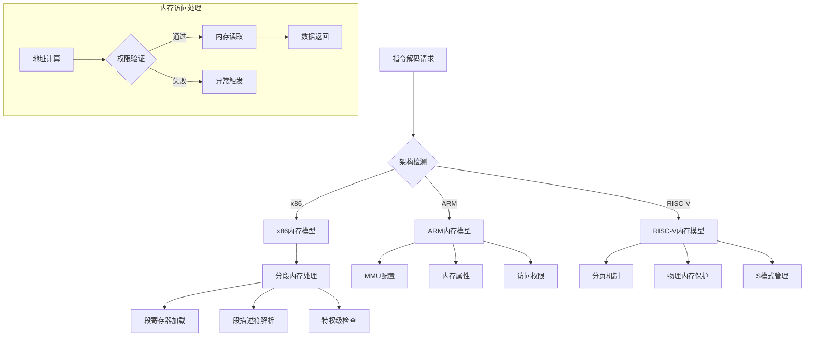

#### 跨平台内存访问适配器

```cpp
class MemoryAdapter {
public:
    virtual uint64_t read(uint64_t addr, size_t size) = 0;
    virtual void write(uint64_t addr, uint64_t value, size_t size) = 0;
    virtual bool check_permission(uint64_t addr, AccessType type) = 0;
};

class X86MemoryAdapter : public MemoryAdapter {
    uint64_t read(uint64_t addr, size_t size) override {
        // 处理x86分段和分页
        uint64_t phys_addr = translate_address(addr);
        return physical_read(phys_addr, size);
    }
    
    bool check_permission(uint64_t addr, AccessType type) override {
        // 检查CPL/RPL/DPL权限
        return check_x86_permissions(addr, type);
    }
};

class ARMMemoryAdapter : public MemoryAdapter {
    uint64_t read(uint64_t addr, size_t size) override {
        // ARM内存属性检查
        if(check_memory_attributes(addr)) {
            return physical_read(addr, size);
        }
        throw MemoryAccessException();
    }
    
    bool check_permission(uint64_t addr, AccessType type) override {
        // 检查EL权限
        return check_arm_permissions(addr, type);
    }
};
```

## 🔬 八、高级调试与验证技术

### 8.1 全生命周期验证框架

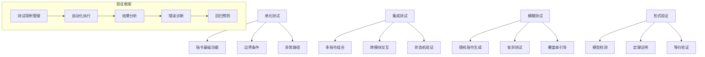

### 8.2 指令级模糊测试引擎

```python
class InstructionFuzzer:
    def __init__(self, arch='x86-64'):
        self.arch = arch
        self.corpus = self.load_seed_corpus()
        self.coverage = CoverageTracker()
        
    def mutate_instruction(self, inst):
        # 多种变异策略
        mutators = [
            self.bit_flip,
            self.byte_swap,
            self.field_perturb,
            self.opcode_replace,
            self.operand_extend
        ]
        return random.choice(mutators)(inst)
    
    def bit_flip(self, inst):
        # 随机翻转指令中的位
        pos = random.randint(0, len(inst)-1)
        new_inst = list(inst)
        new_inst[pos] ^= 1 << random.randint(0,7)
        return bytes(new_inst)
    
    def fuzz_test(self, iterations=10000):
        for _ in range(iterations):
            # 从语料库中选择种子指令
            seed = random.choice(self.corpus)
            # 应用变异
            mutated = self.mutate_instruction(seed)
            
            try:
                # 解码变异后的指令
                result = decoder.decode(mutated)
                # 跟踪覆盖率
                self.coverage.track(result)
            except DecodeException as e:
                # 记录崩溃信息
                self.log_crash(seed, mutated, str(e))
    
    def analyze_coverage(self):
        # 生成覆盖率报告
        report = self.coverage.generate_report()
        # 识别未覆盖的解码路径
        uncovered = self.coverage.get_uncovered()
        # 针对性地生成新测试用例
        for path in uncovered:
            self.generate_targeted_test(path)
```
